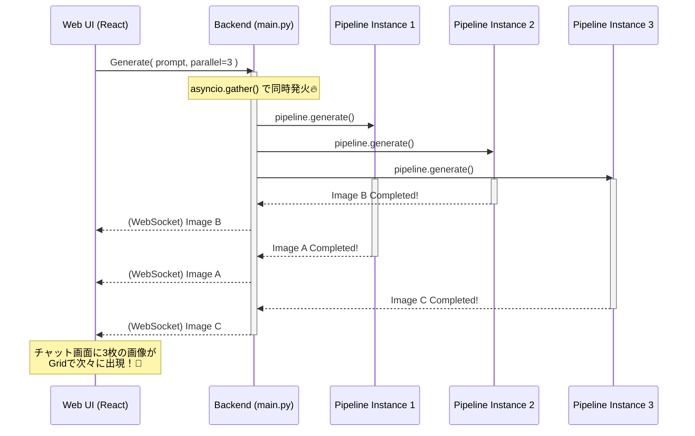
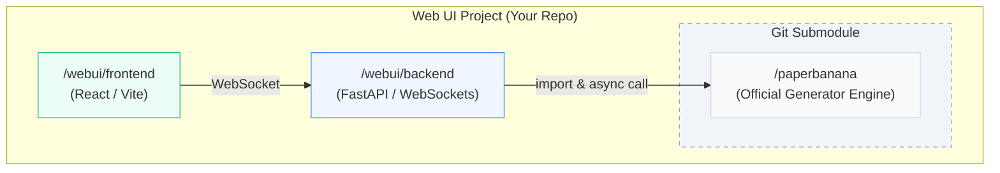

# 🍌 学術図形をもっと手軽に！「PaperBanana」Web UI開発ストーリー ✨

みなさん、こんにちは！👋
論文やプレゼン資料を作るとき、「概念図（Methodology Diagram）」や「フローチャート」を作るのって、時間がかかって大変ですよね…？😢

そんな悩みを解決するのが、テキストベースのプロンプトから学術的な図形を自動生成してくれるツール **「PaperBanana」** です！🍌✨

これまではコマンドライン上で動くちょっと玄人向けのツールだったのですが、もっと色んな人に気軽に使ってもらいたい！ということで、今回 **「PaperBananaのモダンなWeb UI」** を開発しちゃいました！🎉💻

今回は、その開発の裏側と、私たちがぶつかった困難、そしてどうやってそれを乗り越えたのかを、ストーリー仕立てでお届けします！📖✨

---

## 🎨 コンセプト：直感的で「Wow!」な体験を

今回のWeb UI開発のコンセプトは、ズバリ **「Glassmorphism（グラスモーフィズム）」** と **「モダンでプレミアムな体験」** です！✨

* **左ペイン：チャットインターフェース** 💬
  AIエージェントと対話しながら、どんな図を作りたいかプロンプトを入力します。「〇〇の図を作って！」とお願いするだけ！
* **右ペイン：リアルタイムプレビュー＆結果表示** 🖼️
  AIが考えている途中のログ（Phase 0: 情報検索 🔍 → Phase 1: 設計図作成 📝 → Phase 2: 作画 🎨）がリアルタイムで流れ、最終的な美しい図がどーん！と表示されます。

すりガラスのような半透明のUI（Tailwind CSSを活用）で、使っていて気持ちの良い、未来感のあるデザインを目指しました！✨

> 📸 **ここに挿絵を挿入！**
> *コメント：開発したWeb UIの全体画面のキャプチャ（チャット欄とプレビュー画面がわかる綺麗なスクリーンショット）を貼ると効果的です！*

---

## 🚧 発生した困難と、見えてきた「AI生成」の壁

開発は順調にスタート！FastAPI（バックエンド）とReact/Vite（フロントエンド）を疎結合にし、WebSocketでリアルタイム通信するモダンな構成を採用しました🚀

しかし、UIが完成して実際に図を作ってみると、1つ大きな壁にぶつかりました…。

### 💥 困難1：イテレーション（やり直し）で画質が劣化する問題

「ここをもっとこうして！」という追加指示（イテレーション）に対応するため、最初の実装では**「1回目にできた画像をAIに再度読み込ませて、上書き修正させる」** というアプローチを試みました。

ところが…！😱
画像を何度も読み込んで上書きしていくと、**テキストが潰れて読めなくなったり、全体がぼやけたりして、どんどん画質が劣化してしまった** のです😭

> 📸 **ここに挿絵を挿入！**
> *コメント：画質が劣化してしまった失敗例のキャプチャ（文字が潰れているものなど）を貼ると、説得力が増します！*

### 💡 解決策：「設計図」から描き直す！

画質の劣化を防ぐにはどうすればいいか？
私たちが辿り着いた答えは、**「元の画像に手を加えるのではなく、AIが内部で持っている『テキストの設計図（プロンプト）』の方を修正し、毎回ゼロから高画質に描き直す（Text-to-Image）」** という、PaperBanana本来のストロングポイントに立ち返ることでした！✨

これにより、何度やり直しても、文字がクッキリ読める最高品質の図面をキープできるようになりました！🎊

---

## 🚀 さらなる進化へ：同時並列生成（Parallel Generation）の実現！

修正の方針は決まりましたが、ここでふと冷静になって考えてみました。「そもそも一発目の画質が一番綺麗で精度も高いなら、やり直すよりも、**最初から構図の違う何パターンかの図案を一気に出しちゃえばいいんじゃない？**」🤔

この気づきから、プロジェクトはさらなる進化を遂げます！✨

### 💥 困難2：どうやって待たせずに複数作るか？

AIに3パターンの図案を作ってもらうとして、「1案目が終わったら2案目…」と順番（直列）に処理していては、待ち時間が3倍になってしまいます💦

### 💡 解決策：非同期処理で「同時に」作らせる！

ここで、FastAPIとPythonの強力な武器 **`async / await`** と **`asyncio.gather`** の出番です！🔥

バックエンドのアーキテクチャを工夫し、「並列数：3」でリクエストが来たら、**裏側で3つの独立したAIエージェントを「完全に同時」に起動**するようにしました！🧠🧠🧠

これにより、待ち時間はほぼ1案分（数十秒）のまま、**全く異なるテイストの3つの図形が、チャット画面にポンッポンッと次々に現れる** という、最高にスマートなUXが完成しました！🎉✨

---

## 🏗️ こだわりのアーキテクチャ：Gitサブモジュールによる綺麗な分離

最後に、開発者向けのちょっとマニアックな工夫もご紹介します！🛠️

今回のWeb UIは、本家「PaperBanana」のソースコードに直接手を入れるのではなく、**「Gitサブモジュール」** として本家リポジトリを取り込む構成にしました！📦

* **メリット1**：本家のクリーンなソースコードを一切汚さずにUI開発ができる！
* **メリット2**：本家にアップデートがあっても、コマンド一発で簡単に追従できる！

「UIはUI、コアエンジンはコアエンジン」と分離（Complete Separation Architecture）することで、安全で保守性の高いイケてるプロジェクト構成になりました😎✨

---

## 🎉 おわりに

いかがでしたでしょうか？✨
最新のAI機能とモダンなWeb技術を組み合わせることで、「論文の図表作り」という大変な作業が、もっとワクワクする楽しい体験になれば嬉しいです！😆

PaperBanana Web UI、ぜひぜひ使ってみてくださいね！🍌🚀

それでは、次回のアップデートをお楽しみに！👋✨
